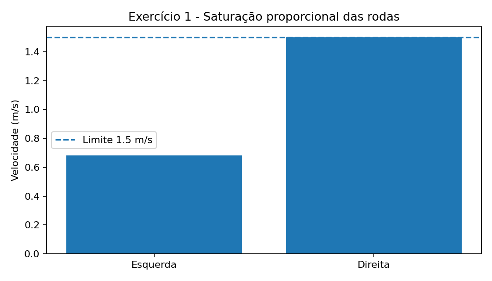
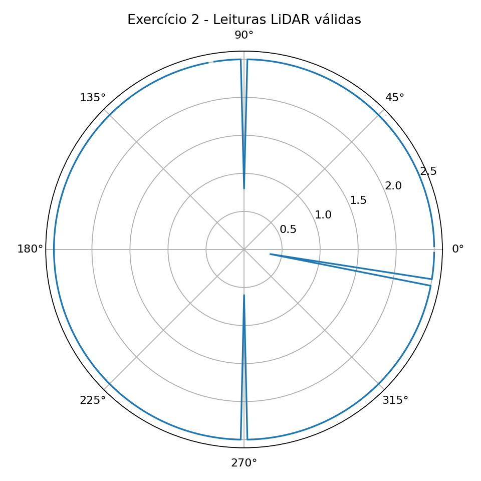
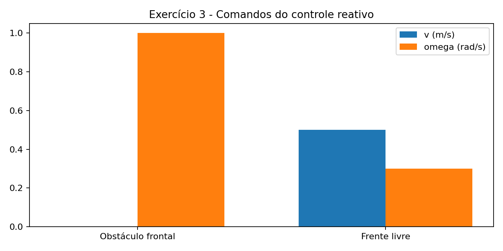
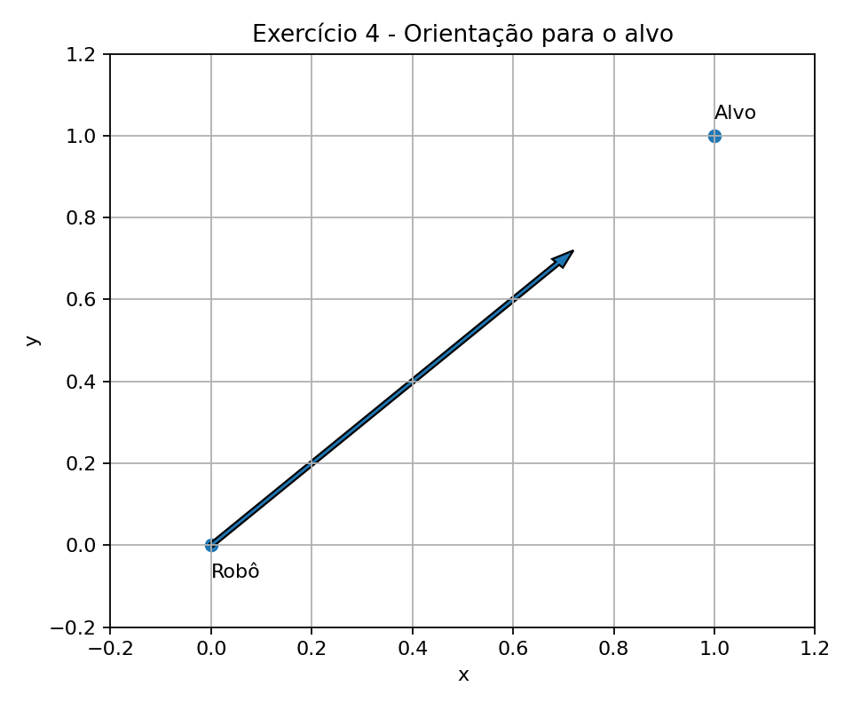
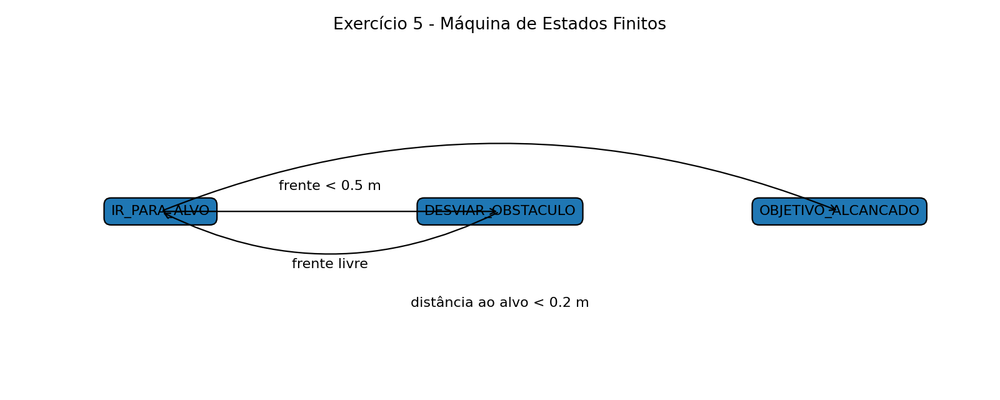

# AULA 05 — Resultados dos Exercícios

Este diretório contém a implementação e as evidências de execução dos 5 exercícios propostos no arquivo `labs_aula05_imr.txt`.

## Exercício 1 — Conversor de `/cmd_vel` com saturação dos motores

Arquivo: `exercicio1.py`

A velocidade de cada roda é calculada para um robô diferencial:

- `v_e = v - (omega * L / 2)`
- `v_d = v + (omega * L / 2)`

Quando alguma roda ultrapassa `1.5 m/s` em módulo, as duas velocidades são reduzidas proporcionalmente para preservar a relação entre elas.

### Saída obtida

```text
Entrada: v=1.20 m/s, omega=3.00 rad/s
Velocidade roda esquerda: 0.682 m/s
Velocidade roda direita:  1.500 m/s
Maior módulo após saturação: 1.500 m/s
```

### Evidência



---

## Exercício 2 — Processamento e filtro do tópico `/scan`

Arquivo: `exercicio2.py`

Foram considerados os setores:

- Frente: `345° a 359°` e `0° a 15°`
- Esquerda: `45° a 135°`
- Direita: `225° a 315°`

Leituras menores que `0.1 m` ou maiores que `5.0 m` são descartadas.

### Saída obtida

```text
Menores distâncias válidas por setor:
Frente  : 0.35 m
Esquerda: 0.80 m
Direita : 0.60 m
```

### Evidência



---

## Exercício 3 — Controle reativo de obstáculos

Arquivo: `exercicio3.py`

Regras implementadas:

- Se `frente < 0.4 m`: `v = 0.0` e o robô gira para o lado com maior espaço.
- Caso contrário: `v = 0.5` e `omega` é ajustado proporcionalmente pela diferença entre as distâncias laterais.

### Saída obtida

```text
obstaculo_frontal:
  distâncias = {'frente': 0.3, 'esquerda': 1.2, 'direita': 0.6}
  comando -> v=0.00 m/s, omega=1.00 rad/s
frente_livre:
  distâncias = {'frente': 1.5, 'esquerda': 0.8, 'direita': 1.1}
  comando -> v=0.50 m/s, omega=0.30 rad/s
```

### Evidência



---

## Exercício 4 — Controlador proporcional para atração ao alvo

Arquivo: `exercicio4.py`

Foi utilizado:

- `theta_alvo = atan2(y_alvo - y, x_alvo - x)`
- erro angular normalizado para `[-pi, pi]`
- `omega = Kp * e_theta`, com `Kp = 1.5`

### Saída obtida

```text
Pose atual: (0.0, 0.0, theta=0.000 rad)
Alvo: (1.0, 1.0)
Theta alvo: 0.785 rad
Erro normalizado: 0.785 rad
Omega (Kp=1.5): 1.178 rad/s
```

### Evidência



---

## Exercício 5 — Máquina de Estados Finitos

Arquivo: `exercicio5.py`

Estados implementados:

1. `IR_PARA_ALVO`
2. `DESVIAR_OBSTACULO`
3. `OBJETIVO_ALCANCADO`

Prioridade das transições:

1. Se a distância euclidiana ao alvo for menor que `0.2 m`, o robô entra em `OBJETIVO_ALCANCADO`.
2. Caso contrário, se a distância frontal for menor que `0.5 m`, entra em `DESVIAR_OBSTACULO`.
3. Nos demais casos, permanece em `IR_PARA_ALVO`.

### Saída obtida

```text
indo_para_alvo: estado=IR_PARA_ALVO, v=0.50 m/s, omega=0.695 rad/s
desviando: estado=DESVIAR_OBSTACULO, v=0.00 m/s, omega=1.000 rad/s
objetivo: estado=OBJETIVO_ALCANCADO, v=0.00 m/s, omega=0.000 rad/s
```

### Evidência



---

## Estrutura final

```text
AULA_05/
├── exercicio1.py
├── exercicio2.py
├── exercicio3.py
├── exercicio4.py
├── exercicio5.py
├── resultados_aula05.md
├── saida_exercicio1.txt
├── saida_exercicio2.txt
├── saida_exercicio3.txt
├── saida_exercicio4.txt
├── saida_exercicio5.txt
└── imagens/
    ├── exercicio1_saturacao.png
    ├── exercicio2_lidar.png
    ├── exercicio3_controle.png
    ├── exercicio4_orientacao.png
    └── exercicio5_fsm.png
```
